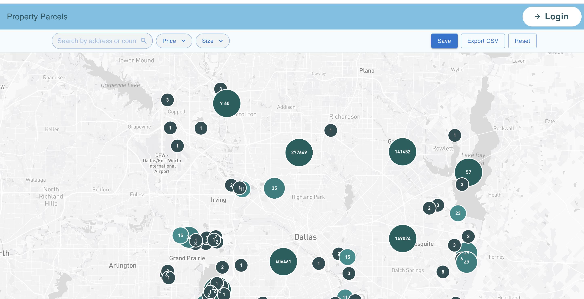
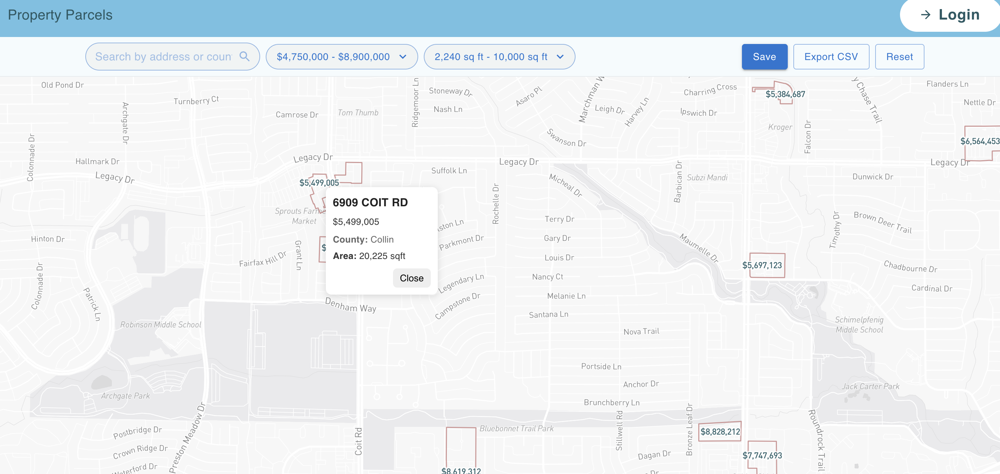

# Property Parcels




This project consists of two main parts:
- **api/**: Backend API built with TypeScript for managing property parcel data.
- **ui/**: Frontend application built with React and Vite for visualizing and interacting with property parcels.

## Getting Started

### Prerequisites
- Node.js (v18 or higher recommended)
- npm or yarn

### Setup

#### 1. Clone the repository
```
git clone https://github.com/congdv/property-parcels
cd property-parcels
```

#### 2. Install dependencies
- For API:
  ```
  cd api
  npm install
  ```
- For UI:
  ```
  cd ../ui
  npm install
  ```

#### 3. Run the applications
- Start the API server:
  ```
  cd api
  npm run start
  ```
- Start the UI:
  ```
  cd ui
  npm run dev
  ```

## Project Structure
```
property-parcels/
  api/      # Backend API
  ui/       # Frontend UI
```

## Testing
- API tests: `cd api && npm test`
- UI tests: `cd ui && npm test`

## License
MIT
